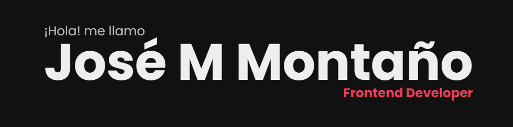

# **Bienvenidos**

Este es mi pagina personal donde encontraran información de mi perfil profesional, mis experiencias mas recientes y las skills que utilice para cada proyecto que trabaje.

## **Instalación**

### Clona el repositorio

```bash
  git clone git@github.com:Mooenz/portfolio.git
```

### Instala las dependencias

```bash
  npm install
```

### Servidor de desarrollo

```bash
  npm run dev
```

## **Demo**

[Mooenz.me](https://www.mooenz.me/)

## **Overview**


## **Contact**

- Website [mooenz.me](https://www.mooenz.me/)
- GitHub [@mooenz](https://github.com/Mooenz)
- Twitter [@mooenzdev](https://twitter.com/MooenzDev)
